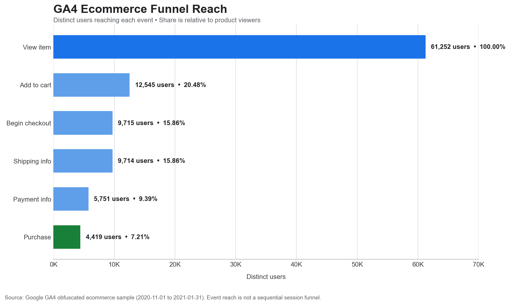

# GA4 BigQuery MCP

An MCP server that lets AI assistants analyze the public Google Analytics 4
ecommerce sample in BigQuery through safe, predefined tools.

This repository also includes a reproducible
[GA4 ecommerce case study](ANALYSIS.md) and its six numbered [SQL queries](sql/).



## Features

- Ecommerce overview: events, users, purchases, and revenue
- Daily performance trends
- Top products by revenue
- Traffic acquisition by source and medium
- Checkout funnel counts
- Parameterized queries and strict date validation

The default dataset is
`bigquery-public-data.ga4_obfuscated_sample_ecommerce`, covering 2020-11-01
through 2021-01-31. It is obfuscated sample data and may contain placeholder or
internally inconsistent values.

## Prerequisites

- Python 3.11+
- A Google Cloud project with the BigQuery API enabled
- Application Default Credentials

```powershell
gcloud auth application-default login
gcloud auth application-default set-quota-project YOUR_PROJECT_ID
```

## Installation

```powershell
python -m venv .venv
.venv\Scripts\Activate.ps1
python -m pip install -e ".[dev]"
```

Set your Google Cloud project for the current terminal:

```powershell
$env:GOOGLE_CLOUD_PROJECT = "YOUR_PROJECT_ID"
```

## Run and inspect

```powershell
mcp dev src/ga4_bigquery_mcp/server.py
```

Or run the stdio server directly:

```powershell
ga4-bigquery-mcp
```

## Example prompts

- Give me an ecommerce overview for the full sample period.
- Show daily revenue during December 2020.
- What were the top 10 products by revenue?
- Which acquisition sources brought the most users?
- Show the checkout funnel for January 2021.

## Use another GA4 export

Set `GA4_BIGQUERY_DATASET` to `project_id.dataset_id`. The export must use the
standard GA4 `events_*` schema. Update the supported date bounds in
`analytics.py` when using a dataset outside the sample period.

## Security and cost

- No credential files belong in this repository.
- Queries use table suffixes so only the requested dates are scanned.
- Each query has a 2 GiB maximum-bytes-billed cap by default and is rejected if
  it would exceed that limit.
- Tool inputs are validated and values are sent as BigQuery parameters.
- Review estimated bytes in BigQuery and configure billing alerts before using
  large production exports.

## Tests

```powershell
pytest
```

## License

MIT
